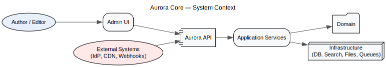
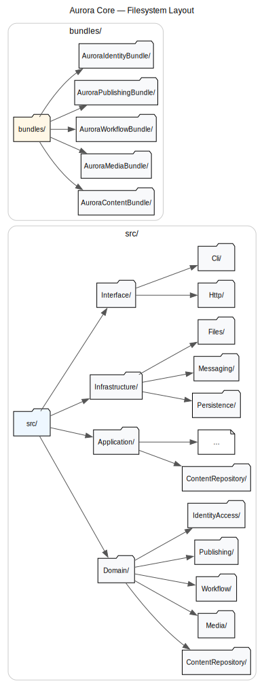

# Aurora Core — Architecture Overview (v0.1)

**Project**: Aurora Core
**Purpose**: Build a Symfony-based, enterprise-grade CMS core applying Clean Architecture principles, loosely inspired by Neos (content-first modeling, strong editor experience), without copying Neos code.
**License**: MIT
**Primary tech**: PHP 8.3+, Symfony 7.x, Doctrine ORM, Symfony Messenger, Twig, API Platform (optional), PostgreSQL, Redis

---

## Table of Contents

1. [Executive Summary](#1-executive-summary)
2. [Vision & Goals](#2-vision--goals)
3. [Non-Goals & Constraints](#3-non-goals--constraints)
4. [Architecture Principles](#4-architecture-principles)
5. [System Context & Capabilities](#5-system-context--capabilities)
6. [Domain & Bounded Contexts](#6-domain--bounded-contexts)
7. [Solution Architecture (Clean Architecture applied)](#7-solution-architecture-clean-architecture-applied)
8. [Modularization & Bundles](#8-modularization--bundles)
9. [Runtime Views](#9-runtime-views)
10. [Data & Persistence](#10-data--persistence)
11. [API Design](#11-api-design)
12. [Messaging & Integrations](#12-messaging--integrations)
13. [Security, Identity & Access](#13-security-identity--access)
14. [Multisite, Multilingual, and Content Rendering](#14-multisite-multilingual-and-content-rendering)
15. [Developer Experience & Quality](#15-developer-experience--quality)
16. [Observability & Operations](#16-observability--operations)
17. [Deployment & Environments](#17-deployment--environments)
18. [Risks & Open Questions](#18-risks--open-questions)
19. [Glossary](#19-glossary)
20. [Appendix A: ADR Template](#20-appendix-a-adr-template)

---

## 1. Executive Summary

Aurora Core reimagines Neos CMS on top of Symfony, preserving Neos’s strengths—content-first modeling, inline editing friendliness, and powerful content repository—while embracing a Clean Architecture approach for testability, maintainability, and enterprise extensibility.

**Key outcomes**:

* Decouple business rules (content, publishing, workflows) from frameworks and IO.
* Establish clear module boundaries (bounded contexts).
* Provide a modern developer experience and sustainable upgrade path.

---

## 2. Vision & Goals

**Vision**: A composable, headless-first CMS core that supports rich authoring and multi-channel delivery.

**Goals**

* Strong domain model for Content, Media, Workflow, and Publishing.
* Stable extension points (events, ports/adapters, public APIs).
* High test coverage with fast CI feedback.
* Safe, guided migration from Neos/Flow.
* Performance, security, and observability by default.

---

## 3. Non-Goals & Constraints

**Non-Goals**

* Feature parity with all Neos packages in v1.0.
* Coupling to a specific frontend framework.

**Constraints**

* MIT license.
* PHP 8.3+, Symfony LTS track compatibility.
* PostgreSQL as the primary relational store; Redis for caching/queues (can be swapped).

---

## 4. Architecture Principles

* **Clean Architecture**: Dependency rule, use-case centric application services, framework at the edges.
* **Neos Principles, applied**: Content-first modeling, structured content, editor experience, DX.
* **Modular Monolith first**: Clear module boundaries, internal APIs; optional microservice extraction later.
* **12-Factor**: Config via environment; immutable builds.
* **C4 Modeling**: Context, Container, Component views.

---

## 5. System Context & Capabilities

**Primary actors**: Authors, Editors, Developers, Integrations (CDN, DAM, Search, Identity Provider).

Core capabilities: Content Modeling, Editorial Workflows, Publishing & Preview, Media/DAM hooks, Multisite & i18n, Headless delivery.

---

## 6. Domain & Bounded Contexts

* **Content Repository (CR)**: Nodes, node types, properties, references, versioning.
* **Rendering & Delivery**: View models, templating, URL routing, headless APIs.
* **Media**: Asset metadata, variants, external storage providers.
* **Workflow**: Drafts, approvals, scheduling, audit.
* **Publishing**: Channels, previews, rollbacks.
* **Identity & Access**: Users, roles, permissions, policies.

Each context publishes domain events (e.g., `ContentNodePublished`, `AssetTranscoded`).

---

## 7. Solution Architecture (Clean Architecture applied)

**Layers**

* **Domain**: Entities, value objects, aggregates, domain services, domain events.
* **Application**: Use cases (services/handlers), input/output DTOs, transaction boundaries.
* **Interface Adapters**: Controllers, CLI, presenters, mappers.
* **Infrastructure**: Persistence (Doctrine), messaging (Messenger), HTTP clients, filesystem.

**Dependency Rule**: Only inward dependencies. Domain has no Symfony/IO dependencies.

---

## 8. Modularization & Bundles

**Recommended package layout** (modular monolith):

Bundles expose Symfony wiring while shielding inner layers. Public extension points are documented per bundle.

---

## 9. Runtime Views

**Request lifecycle**

1. HTTP request → Controller (Adapter)
2. Controller → Application use case
3. Use case → Domain operations
4. Domain events → Messenger bus (async/sync)
5. Presenter → View model/Response

**Event flow example**

* `CreateNode` → `NodeCreated` → projectors update read models → cache invalidation → webhooks.

---

## 10. Data & Persistence

* **Relational**: PostgreSQL via Doctrine ORM.
* **Migrations**: Doctrine Migrations; seeders for default types.
* **Caching**: Symfony Cache (Redis).
* **Read models**: CQRS-friendly projections for queries & search.
* **Files**: Flysystem adapters (S3, local); media variants pipeline.

**Versioning**: Event-sourced history for CR is optional; v1 uses relational version tables with immutable snapshots, upgradeable to an Event Store later.

---

## 11. API Design

* **HTTP APIs**: JSON over REST; optional API Platform for DTOs, pagination, filtering.
* **Webhooks**: Signed calls for publish/workflow events.
* **GraphQL**: Consider for headless queries in v1.x.

Documentation via OpenAPI; SDKs generated as needed.

---

## 12. Messaging & Integrations

* **Bus**: Symfony Messenger for commands/events.
* **Transport**: Redis (dev) and RabbitMQ (prod); pluggable.
* **Outbox**: Transactional outbox for reliable event delivery.
* **Integrations**: Search (Elasticsearch/OpenSearch), CDN purge, DAM connectors.

---

## 13. Security, Identity & Access

* **AuthN**: OIDC (e.g., Keycloak) via Symfony Security; fallback local accounts.
* **AuthZ**: Policy-based (RBAC + content-scoped permissions).
* **Secrets**: Vault/Parameter store; never in repo.
* **Auditing**: Immutable audit log of content changes & approvals.

---

## 14. Multisite, Multilingual, and Content Rendering

* **Multisite**: Site entity with isolated trees; shared media.
* **i18n**: Locale-aware nodes; fallback chains; slug translation strategy.
* **Rendering**: Twig-based server-side rendering; headless JSON representations.
* **Preview**: Draft/preview channels with URL signing.

---

## 15. Developer Experience & Quality

* **Standards**: PSR-12; strict types.
* **Tooling**: PHP-CS-Fixer, PHPStan (max level), Psalm optional.
* **Tests**: PHPUnit (unit), Behat (BDD for use cases), Panther/BrowserKit for UI smoke.
* **Makefile & Composer scripts** for common tasks.
* **CI**: Static analysis, unit tests, mutation tests (Infection), security checks.
* **Repo layout**: Modular monolith in a single repo; package boundaries enforced via deptrac.

---

## 16. Observability & Operations

* **Logs**: Monolog to STDOUT; JSON format.
* **Metrics**: Prometheus via Symfony exporter; key use-case timers.
* **Tracing**: OpenTelemetry instrumentation.
* **Health**: /health, /ready endpoints; DB, queue, cache checks.

---

## 17. Deployment & Environments

* **Containers**: Docker images; distroless where possible.
* **Config**: `.env` for dev; env vars for prod.
* **CDN**: Cache-control & purge hooks.
* **Scaling**: Horizontal for stateless web; dedicated workers for queues.
* **Blue/Green**: Zero-downtime deploys; DB migrations with safety checks.

---

## 18. Risks & Open Questions

* Twig-only rendering path.
* Event sourcing scope in v1.
* Backward compatibility for existing Neos node types and CR structure.
* Search engine choice and indexing model.

---

## 19. Glossary

* **CR**: Content Repository, hierarchical content storage.
* **BC**: Bounded Context.
* **DTO**: Data Transfer Object.
* **CQRS**: Command Query Responsibility Segregation.

---

## 20. Appendix A: ADR Template

**Title**: <decision name>

**Status**: Proposed | Accepted | Deprecated | Superseded

**Context**
What problem are we solving? What constraints exist?

**Decision**
What option did we choose and why (trade-offs)?

**Consequences**
Positive, negative, risks, follow-ups.

**References**
Links to discussions, spikes, benchmarks.

